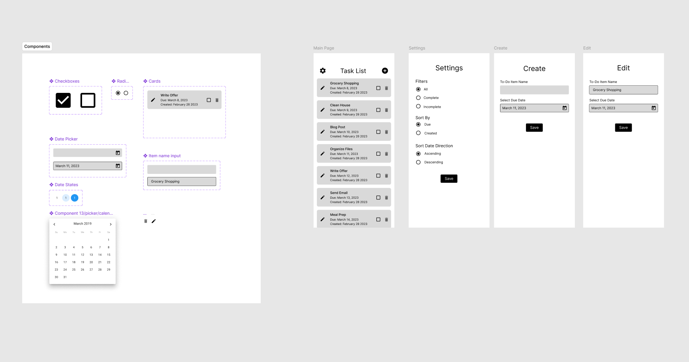

# To Do 
This is a REACT application that implements an application that allows users to keep track of tasks that they need/want to do. 

## How to Run
To run this application, have the following installed:
* Node.js 22.23.2
* Node Package Manager
NOTE: Will not run without the specified Node.js version

Install everything with the command: 
> npm install

To start the application, run the following in command prompt:
> npm run dev

# Mapping Diagram
The application is set up and runs as follows:

## Files
### Core
* main.jsx: application entry point; imports global CSS and renders App.
* App.jsx: central coordinator; creates routes, uses useTasks, and stores filter/sort settings.

### Routes
* MainPage.jsx: main layout; shows the header and task list.
* Settings.jsx: controls filtering and sorting preferences.
* Create.jsx: form for creating a task.
* Edit.jsx: form for editing a selected task.

### Data
* TaskList.jsx: filters, sorts, and displays tasks; handles navigation for editing.
* mutateTasks.jsx: task state and task manipulation logic.

### Styles
* Forms.css: create, edit, and settings form styles.
* TaskList.css: task card styles.
* App.css: main header and logo styles.
* index.css: global layout, colors, typography, and root styles.

# Design
The UI for this app was created in Figma by an external party.

# React + Vite

App was initialized with the following template that provided a minimal setup to get React working in Vite with HMR and some Oxlint rules.

Currently, two official plugins are available:

- [@vitejs/plugin-react](https://github.com/vitejs/vite-plugin-react/blob/main/packages/plugin-react) uses [Oxc](https://oxc.rs)
- [@vitejs/plugin-react-swc](https://github.com/vitejs/vite-plugin-react/blob/main/packages/plugin-react-swc) uses [SWC](https://swc.rs/)

## React Compiler

The React Compiler is not enabled on this template because of its impact on dev & build performances. To add it, see [this documentation](https://react.dev/learn/react-compiler/installation).

## Expanding the Oxlint configuration

If you are developing a production application, we recommend using TypeScript with type-aware lint rules enabled. Check out the [TS template](https://github.com/vitejs/vite/tree/main/packages/create-vite/template-react-ts) for information on how to integrate TypeScript and Oxlint's TypeScript related rules in your project.
